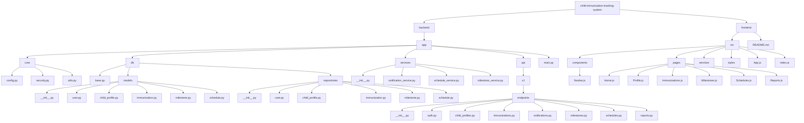

### Backend Folder Structure

Here is the folder structure for the backend of this child immunisation tracking system and how each component is interconnected:



### Representation of Folder Structure

Here's the text code showing the folder structure of the project:

```txt
child-immunization-tracking-system/
├── backend/
│   ├── Pipfile
│   ├── Pipfile.lock
│   └── app/
│       ├── main.py
│       ├── core/
│       │   ├── config.py
│       │   ├── security.py
│       │   └── utils.py
│       ├── db/
│       │   ├── base.py
│       │   ├── models/
│       │   │   ├── __init__.py
│       │   │   ├── user.py
│       │   │   ├── child_profile.py
│       │   │   ├── immunization.py
│       │   │   ├── milestone.py
│       │   │   └── schedule.py
│       │   └── repositories/
│       │       ├── __init__.py
│       │       ├── user.py
│       │       ├── child_profile.py
│       │       ├── immunization.py
│       │       ├── milestone.py
│       │       └── schedule.py
│       ├── services/
│       │   ├── __init__.py
│       │   ├── notification_service.py
│       │   ├── schedule_service.py
│       │   └── milestone_service.py
│       └── api/
│           └── v1/
│               └── endpoints/
│                   ├── __init__.py
│                   ├── auth.py
│                   ├── child_profiles.py
│                   ├── immunizations.py
│                   ├── notifications.py
│                   ├── milestones.py
│                   ├── schedules.py
│                   └── reports.py
├── frontend/
│   ├── README.md
│   └── src/
│       ├── components/
│       │   └── Navbar.js
│       ├── pages/
│       │   ├── Home.js
│       │   ├── Profile.js
│       │   ├── Immunizations.js
│       │   ├── Milestones.js
│       │   ├── Schedules.js
│       │   └── Reports.js
│       ├── services/
│       ├── styles/
│       ├── App.js
│       └── index.js
```


#### 1. **`backend/`**
   - **`Pipfile`** and **`Pipfile.lock`**: These files are used by `pipenv` to manage dependencies. The `Pipfile` lists the dependencies required for the project, while the `Pipfile.lock` ensures that the same versions of dependencies are used.

#### 2. **`backend/app/`**
   - The `app` directory contains all the source code for the FastAPI application.

##### **`app/main.py`**
   - This is the entry point of the FastAPI application. It initializes the FastAPI app and includes the routers for the API endpoints.

##### **`app/core/`**
   - **`config.py`**: Contains configuration settings for the application using Pydantic. This typically includes settings like database URLs, email server configurations, etc.
   - **`security.py`**: Contains utilities for password hashing and verification (e.g., using `passlib`).
   - **`utils.py`**: General utility functions that can be used throughout the application (e.g., custom message generators).

##### **`app/db/`**
   - **`base.py`**: Establishes the database connection using `motor` (an async MongoDB driver for Python).
   
   - **`models/`**
     - **`__init__.py`**: Marks the directory as a Python module.
     - **`user.py`**: Defines the User model schema.
     - **`child_profile.py`**: Defines the ChildProfile model schema.
     - **`immunization.py`**: Defines the Immunization model schema.
     - **`milestone.py`**: Defines the Milestone model schema.
     - **`schedule.py`**: Defines the Schedule model schema.
   
   - **`repositories/`**
     - **`__init__.py`**: Marks the directory as a Python module.
     - **`user.py`**: Contains CRUD operations for the User model.
     - **`child_profile.py`**: Contains CRUD operations for the ChildProfile model.
     - **`immunization.py`**: Contains CRUD operations for the Immunization model.
     - **`milestone.py`**: Contains CRUD operations for the Milestone model.
     - **`schedule.py`**: Contains CRUD operations for the Schedule model.

##### **`app/services/`**
   - **`__init__.py`**: Marks the directory as a Python module.
   - **`notification_service.py`**: Contains logic for sending notifications (e.g., via email).
   - **`schedule_service.py`**: Contains business logic related to schedules.
   - **`milestone_service.py`**: Contains business logic related to milestones.

##### **`app/api/v1/endpoints/`**
   - **`__init__.py`**: Marks the directory as a Python module.
   - **`auth.py`**: Contains endpoints related to authentication (e.g., user registration).
   - **`child_profiles.py`**: Contains endpoints related to child profiles.
   - **`immunizations.py`**: Contains endpoints related to immunizations.
   - **`notifications.py`**: Contains endpoints related to notifications.
   - **`milestones.py`**: Contains endpoints related to milestones.
   - **`schedules.py`**: Contains endpoints related to schedules.
   - **`reports.py`**: Contains endpoints related to reports.

### Expected Implementations

#### **Configuration (`app/core/config.py`)**
- Define a `Settings` class using Pydantic to manage configuration settings. Ensure it reads values from environment variables or a `.env` file.

#### **Security (`app/core/security.py`)**
- Implement password hashing and verification functions using `passlib`.

#### **Utilities (`app/core/utils.py`)**
- Implement utility functions such as a custom message generator for notifications.

#### **Database Connection (`app/db/base.py`)**
- Set up the database connection using `motor.motor_asyncio.AsyncIOMotorClient`.

#### **Models (`app/db/models/`)**
- Define Pydantic models for each domain entity (User, ChildProfile, Immunization, Milestone, Schedule). These models should represent the schema of the data stored in the database.

#### **Repositories (`app/db/repositories/`)**
- Implement CRUD operations for each model. These should handle database interactions (e.g., inserting, querying, updating, deleting documents).

#### **Services (`app/services/`)**
- Implement business logic and service functions. For example, the notification service should handle sending emails, while the schedule service might handle scheduling logic.

#### **API Endpoints (`app/api/v1/endpoints/`)**
- Implement the FastAPI route handlers. These functions should handle HTTP requests, interact with the services/repositories, and return appropriate responses.

#### **Main Application (`app/main.py`)**
- Initialize the FastAPI app, include routers, and run the Uvicorn server if the script is executed directly.

### Example Implementations

#### `app/core/config.py`
```python
from pydantic import BaseSettings

class Settings(BaseSettings):
    DATABASE_URL: str
    MAIL_USERNAME: str
    MAIL_PASSWORD: str
    MAIL_FROM: str
    MAIL_PORT: int
    MAIL_SERVER: str
    MAIL_FROM_NAME: str

    class Config:
        env_file = ".env"

settings = Settings()
```

#### `app/db/models/user.py`
```python
from pydantic import BaseModel, EmailStr

class User(BaseModel):
    email: EmailStr
    full_name: str
    hashed_password: str
```

#### `app/db/repositories/user.py`
```python
from app.db.base import database
from app.db.models.user import User

class UserRepository:

    async def create_user(self, user: User):
        await database["users"].insert_one(user.dict())

    async def get_user_by_email(self, email: str):
        return await database["users"].find_one({"email": email})
```

#### `app/services/notification_service.py`
```python
from fastapi_mail import FastMail, MessageSchema
from app.core.config import settings

class NotificationService:

    def __init__(self):
        self.mail = FastMail(
            config=dict(
                MAIL_USERNAME=settings.MAIL_USERNAME,
                MAIL_PASSWORD=settings.MAIL_PASSWORD,
                MAIL_FROM=settings.MAIL_FROM,
                MAIL_PORT=settings.MAIL_PORT,
                MAIL_SERVER=settings.MAIL_SERVER,
                MAIL_FROM_NAME=settings.MAIL_FROM_NAME
            )
        )

    async def send_notification(self, email: str, subject: str, body: str):
        message = MessageSchema(
            subject=subject,
            recipients=[email],
            body=body,
            subtype="html"
        )
        await self.mail.send_message(message)
```
